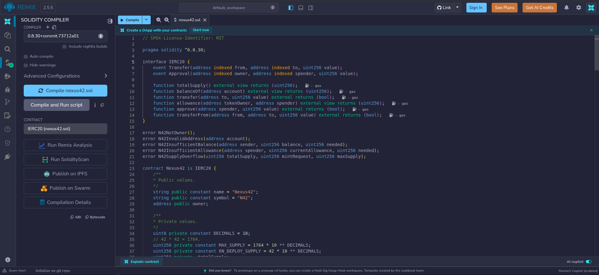
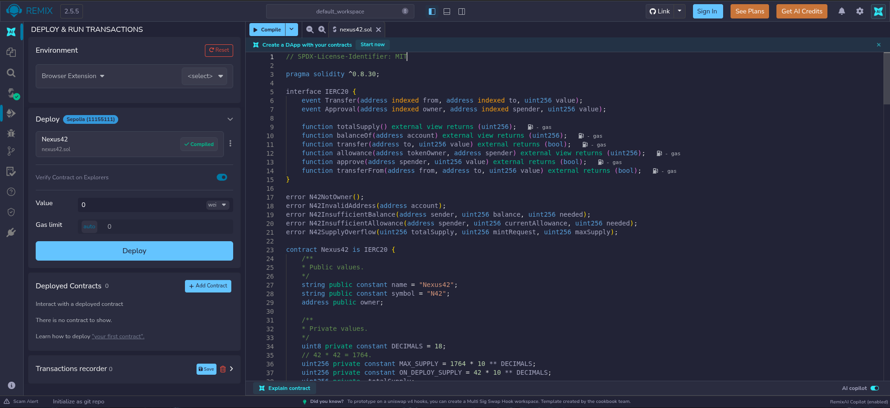
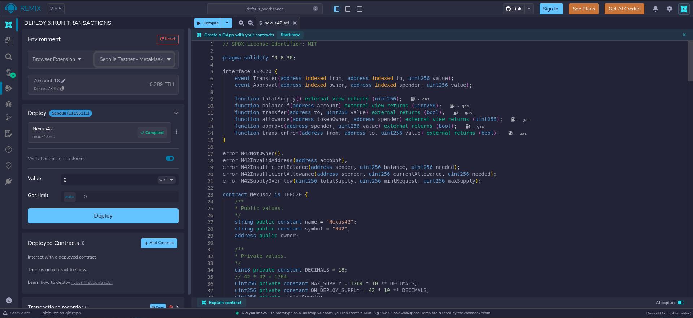
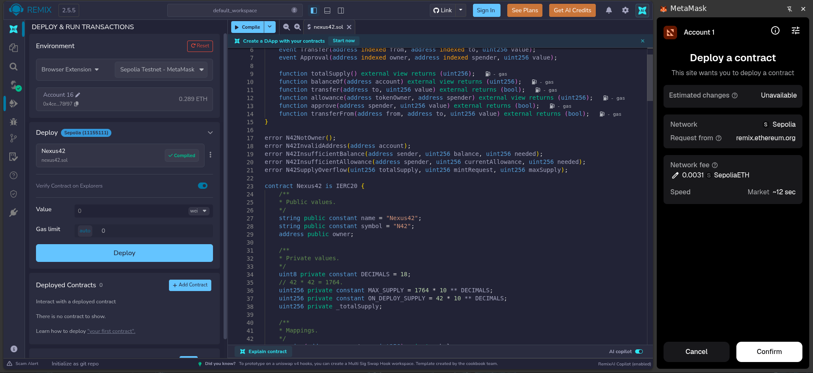
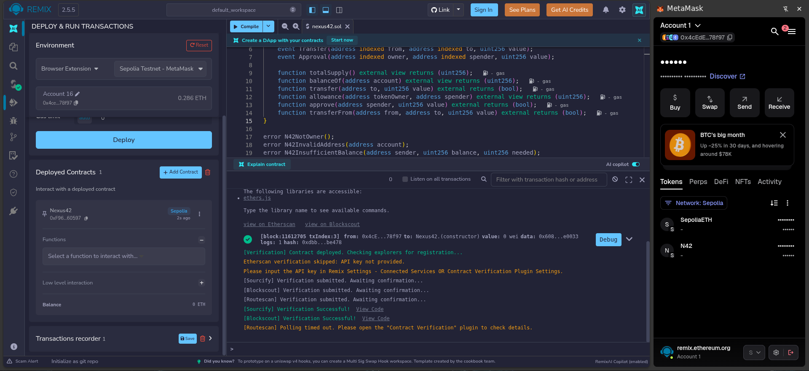

# Remix IDE

[**Remix IDE**][1] is a browser-based development environment designed for writing, compiling, deploying and interacting
with Ethereum smart contracts. It provides an accessible interface for developing Solidity applications without
requiring a local blockchain environment.

In this project, Remix is used to:

- **Write and edit Solidity code** — Develop the Nexus42 smart contract directly in the browser.
- **Compile the contract** — Compile the Solidity source code and check it for syntax and type errors.
- **Deploy the contract** — Deploy the Nexus42 contract to the **Sepolia testnet** using a connected wallet.
- **Interact with the contract** — Call read-only functions such as `balanceOf()` and `totalSupply()`, as well as execute state-changing functions such as `transfer()`, `approve()` and `mint()`.

Remix therefore serves as the primary development and testing environment for the Nexus42 smart contract, from initial implementation through deployment and validation on Sepolia.

---

# Compilation and Deployment

## Compilation

Once the contract is written, it must be compiled. The goal of compiling a Solidity contract is to transform the
human-readable Solidity source code into bytecode that the Ethereum Virtual Machine can execute. The compiler also
performs several important checks along the way such as syntax and type and checking. It then generates the bytecode
and the **Application Binary Interface (ABI)** which describes how tools such as Remix, Etherscan and wallets how to interact
with the contract.

A good practice is to explicitly write the Solidity compiler version required by the contract. For example, the Nexus42
contract is compatible with compiler versions from `0.8.30` up to, but not including, `0.9.0`.

```solidity
pragma solidity ^0.8.30;
```

This compiler version can be selected in the `Solidity compiler` tab.



---

## Deployment

We can now move to the `Deploy & run transactions` tab and select the deployment environment. In this project, I am using 
MetaMask's Chrome extension.



We then select the `Sepolia Testnet - MetaMask` option, the account we want to deploy with and the correct contract.



Click the `Deploy` button and confirm the operation.



We just deployed our first smart contract! It can be seen in the MetaMask wallet by adding a custom token, which requires the
contract address.



The `Deployed contracts` section now contains the deployed contract, which can be expanded to interact with its functions.

[1]: https://remix.ethereum.org/#lang=en&optimize&runs=200&evmVersion&version=soljson-v0.8.34+commit.80d5c536.js
