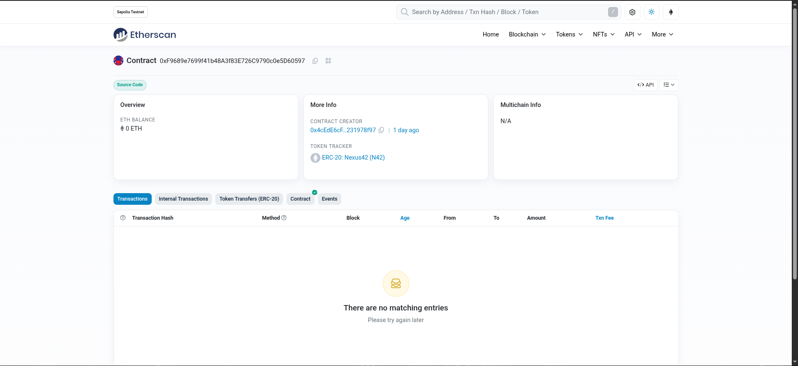
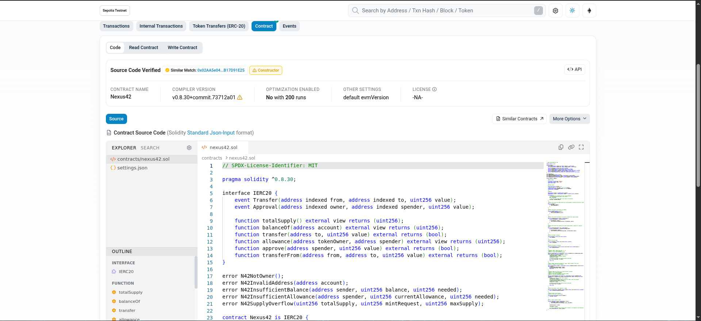
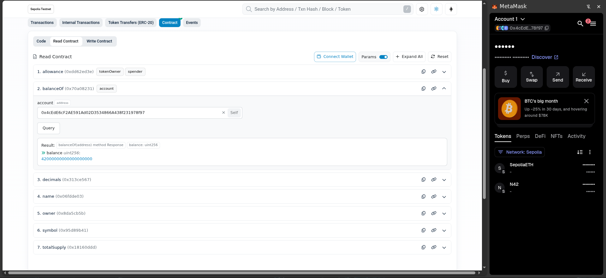

# Etherscan

**Etherscan** is a blockchain explorer that provides a transparent interface for inspecting and interacting with
Ethereum smart contracts and transactions. It allows users to verify contract source code, inspect transactions and
events, view token balances, and interact directly with deployed contracts through their verified interfaces.

## Use Cases

Etherscan can be used to:

- **Read the contract's source code** — Read the Solidity source code and ABI.
- **Inspect transactions** — Monitor deployments, token transfers, minting, and approvals on the Sepolia testnet.
- **Inspect contract state** — View values such as token balances, total supply, and allowances.
- **Interact with the contract** — Call read-only functions and submit transactions to state-changing functions through the contract's interface.
- **Track token activity** — Follow `Transfer` and `Approval` events emitted by the Nexus42 contract.
- **Validate deployment** — Confirm that the deployed bytecode corresponds to the verified Solidity source code.

The Etherscan page for our deployed contract can be found [here][1].

The source code can be read under `Contract > Code`.

The read-only and write functions can be found under `Read Contract` and `Write Contract` respectively.

For example, we can call the `balanceOf()` function and provide the deployer’s address. The contract is designed so the
deployer becomes the owner and receives 42 tokens.

[1]: https://sepolia.etherscan.io/address/0xF9689e7699f41b48A3f83E726C9790c0e5D60597
